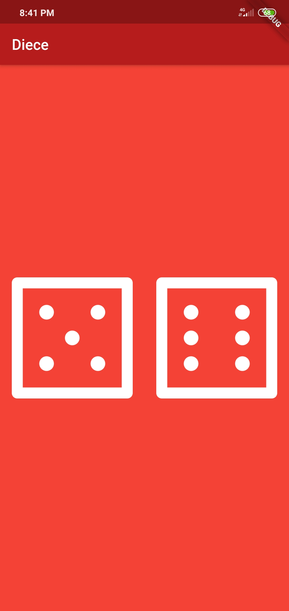

# roll_diece

A new Flutter application.

# information
this is just dice game , where we use random function to get random number on dice.
we have 6 dice no using we can get any no depend on your luck ,also you can this functionality in other diece related games too.
we have 6 png file of dice and each time we change state and print given no randomly.

# screen shot

